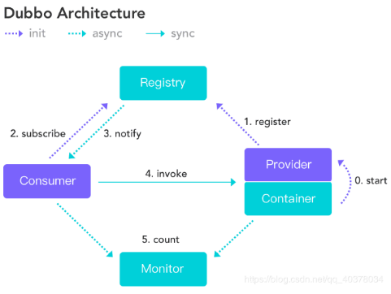

# Dubbo 入门使用

## Dubbo 介绍

### 1、Dubbo 是什么

Dubbo 是阿里巴巴开源的基于 Java 的高性能 RPC（一种远程调用）分布式服务框架（SOA），致力于提供高性能和透明化的 RPC 远程服务调用方案，以及 SOA 服务治理方案

### 2、Dubbo架构（官网图）



* 节点角色说明

|   节点    |              角色说明               |
| :-------: | :---------------------------------: |
| Provider  |         暴露服务的服务提供方         |
| Consumer  |       调用远程服务的服务消费方        |
| Registry  |       服务注册与发现的注册中心        |
|  Monitor  | 统计服务的调用次数和调用时间的监控中心 |
| Container |             服务运行容器             |

* 调用关系说明

0.服务容器负责启动，加载，运行服务提供者

1.服务提供者在启动时，向注册中心注册自己提供的服务

2.服务消费者在启动时，向注册中心订阅自己所需的服务

3.注册中心返回服务提供者地址列表给消费者，如果有变更，注册中心将基于长连接推送变更数据给消费者

4.服务消费者，从提供者地址列表中，基于软负载均衡算法，选一台提供者进行调用，如果调用失败，再选另一台调用

5.服务消费者和提供者，在内存中累计调用次数和调用时间，定时每分钟发送一次统计数据到监控中心


## SpringBoot 配合使用 Dubbo + ZooKeeper

### 一、服务提供者

#### pom 文件引入依赖：

```xml
<!-- API接口依赖 -->
<!-- ... ... -->

<!-- Spring Boot -->
<dependency>
    <groupId>org.springframework.boot</groupId>
    <artifactId>spring-boot-starter</artifactId>
</dependency>

<!-- Aapche Dubbo  -->
<dependency>
    <groupId>org.apache.dubbo</groupId>
    <artifactId>dubbo-spring-boot-starter</artifactId>
    <version>2.7.3</version>
</dependency>

<dependency>
    <groupId>org.apache.dubbo</groupId>
    <artifactId>dubbo</artifactId>
    <version>2.7.3</version>
    <exclusions>
        <exclusion>
            <groupId>org.springframework</groupId>
            <artifactId>spring</artifactId>
        </exclusion>
        <exclusion>
            <groupId>javax.servlet</groupId>
            <artifactId>servlet-api</artifactId>
        </exclusion>
        <exclusion>
            <groupId>log4j</groupId>
            <artifactId>log4j</artifactId>
        </exclusion>
    </exclusions>
</dependency>

<!-- Zookeeper dependencies -->
<dependency>
    <groupId>org.apache.dubbo</groupId>
    <artifactId>dubbo-dependencies-zookeeper</artifactId>
    <version>2.7.3</version>
    <type>pom</type>
    <exclusions>
        <exclusion>
            <groupId>org.slf4j</groupId>
            <artifactId>slf4j-log4j12</artifactId>
        </exclusion>
    </exclusions>
</dependency>
```

#### application.yaml：

```yaml
## Dubbo 服务提供者配置
dubbo:
  application:
    #注册在注册中心的名称，唯一标识，请勿重复
    id: provider
    #dubbo.application.name默认值为spring.application.name
    name: provider
  registry:
    #注册中心地址，zookeeper集群，启动输出可以看见链接了多个
    #多zookeeper服务：zookeeper://IP:Port1,IP:Port2
    #单zookeeper服务：zookeeper://IP:Port
    address: zookeeper://192.168.188.128:2181
  #dubbo协议配置
  protocol:
    id: dubbo
    #默认名称，勿修改
    name: dubbo
    #暴露服务端口 （默认是20880，修改端口，不同的服务提供者端口不能重复）
    port: 20880
    status : server
#要扫描dubbo组件的基本包
  scan:
    base-packages: com.example.product

```

#### 发布服务：

```java
//接口实现类上贴Dubbo的Service注解
@org.apache.dubbo.config.annotation.Service
```

### 二、服务消费者

#### pom文件引入依赖：

```xml
<!-- API接口依赖 -->
<!-- ... ... -->

<!-- Spring Boot -->
<dependency>
    <groupId>org.springframework.boot</groupId>
    <artifactId>spring-boot-starter</artifactId>
</dependency>
<dependency>
    <groupId>org.springframework.boot</groupId>
    <artifactId>spring-boot-starter-web</artifactId>
</dependency>

<!-- Aapche Dubbo  -->
<dependency>
    <groupId>org.apache.dubbo</groupId>
    <artifactId>dubbo-spring-boot-starter</artifactId>
    <version>2.7.3</version>
</dependency>

<dependency>
    <groupId>org.apache.dubbo</groupId>
    <artifactId>dubbo</artifactId>
    <version>2.7.3</version>
    <exclusions>
        <exclusion>
            <groupId>org.springframework</groupId>
            <artifactId>spring</artifactId>
        </exclusion>
        <exclusion>
            <groupId>javax.servlet</groupId>
            <artifactId>servlet-api</artifactId>
        </exclusion>
        <exclusion>
            <groupId>log4j</groupId>
            <artifactId>log4j</artifactId>
        </exclusion>
    </exclusions>
</dependency>

<!-- Zookeeper dependencies -->
<dependency>
    <groupId>org.apache.dubbo</groupId>
    <artifactId>dubbo-dependencies-zookeeper</artifactId>
    <version>2.7.3</version>
    <type>pom</type>
    <exclusions>
        <exclusion>
            <groupId>org.slf4j</groupId>
            <artifactId>slf4j-log4j12</artifactId>
        </exclusion>
    </exclusions>
</dependency>
```

#### application.yaml：

```yaml
## Dubbo 服务消费者配置
dubbo:
  application:
    #注册在注册中心的名称，唯一标识，请勿重复
    id: consumer
    #dubbo.application.name默认值为spring.application.name
    name: consumer
  registry:
    #注册中心地址，zookeeper集群，启动输出可以看见链接了多个
    #多zookeeper服务：zookeeper://IP:Port1,IP:Port2
    #单zookeeper服务：zookeeper://IP:Port
    address: zookeeper://192.168.188.128:2181
```

#### 引用服务

```java
//使用Dubbo提供的Reference注解注入代理对象
@org.apache.dubbo.config.annotation.Reference
```

