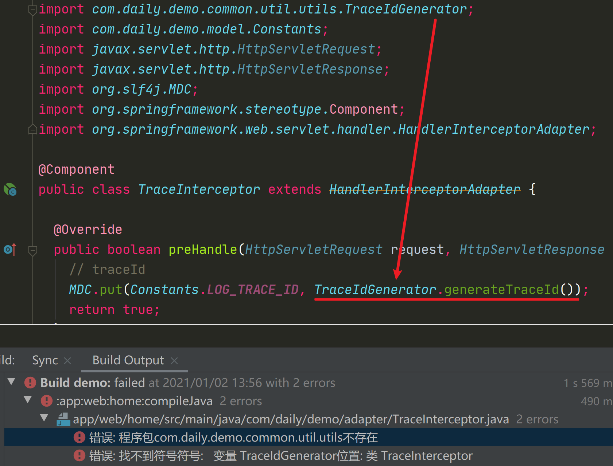
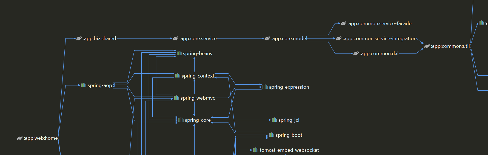
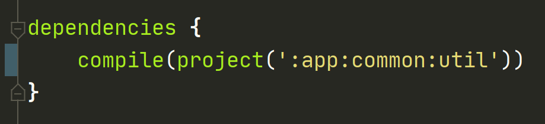
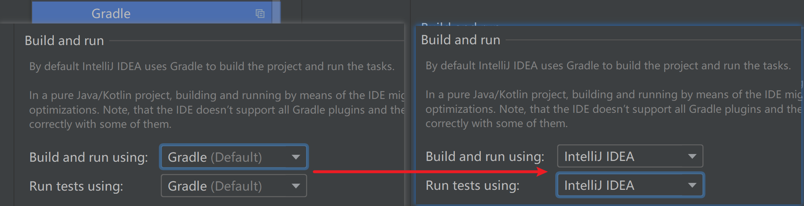
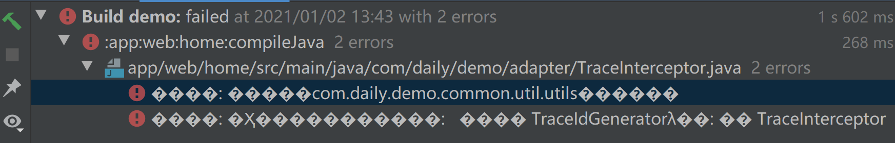

# Gradle多模块项目编译报错

 

* IDEA 使用依赖包的类能正常引入，看依赖引用关系图貌似也没有问题，但是编译就报错。

 

* 本以为是依赖传递问题，但将依赖引用方式 implementation 改为 compile 后还是没能解决问题。
*implementation 依赖不会向下传递*

 

* 最后在 IDEA 设置 Gradle 配置下找到 build and run 配置，将默认的 Gradle 改为 Intellij IDEA。问题已经完美解决。

 

* 报错提示如果是乱码的话，可以在 IDEA 菜单栏 Help->Edit Custom VM Options 文件最后添加启动参数 `-Dfile.encoding=UTF-8` ，
重启 IDEA 后生效

 

