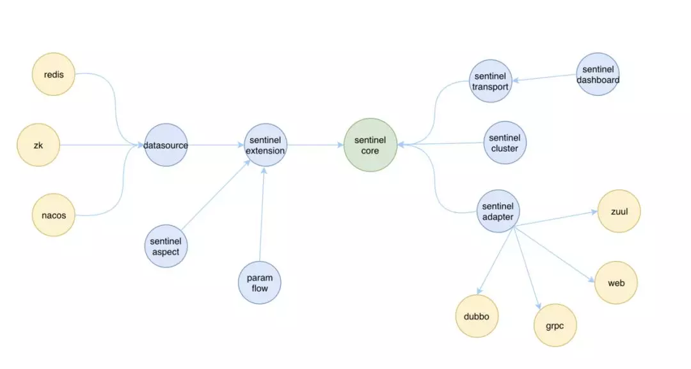
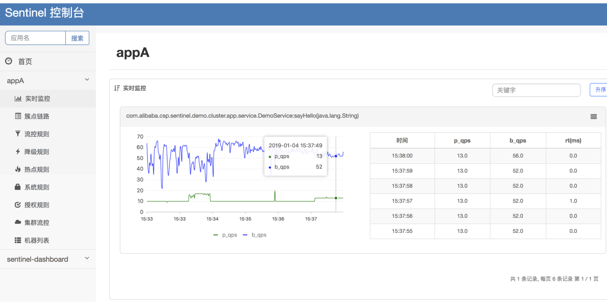

# 阿里限流中间件 Sentinel

谈到高可用系统，大家可能会想到高可用的一些保护手段：缓存、限流等。

我们今天就来聊一聊限流，以及限流常用到的一个开源框架 Sentinel

### 1、首先什么是限流？

​	限流是指对超出服务处理能力之外的请求进行拦截，对访问服务的流量进行限制。

### 2、为什么要限流？

​	如果接口无法控制调用方的行为，在面对热点业务突发请求或者恶意攻击等带来的请求量激增的情况时，就容易导致请求变慢或超时，甚至引起服务器宕机。
​	通过限制并发请求数，使得系统能够正常的处理部分用户的请求，来保证系统的稳定性。

## 什么是 Sentinel 呢

下面给出 Sentinel 官方的介绍。

随着微服务的流行，服务和服务之间的稳定性变得越来越重要。Sentinel 是面向分布式服务架构的流量控制组件，主要以流量为切入点，从限流、流量整形、熔断降级、系统负载保护、热点防护等多个维度来帮助开发者保障微服务的稳定性。

### Sentinel 基本概念

* 资源

  资源是 Sentinel 的关键概念。它可以是 Java 应用程序中的任何内容，例如，由应用程序提供的服务，或由应用程序调用的其它应用提供的服务，甚至可以是一段代码。

  例如：

  ​		可以是一个方法：

  ```java
  @SentinelResource("HelloWorld")
  public void helloWorld() {
      // 资源中的逻辑
      System.out.println("hello world");
  }
  ```

  ​		可以是一段代码：

  ```java
  // 1.5.0 版本开始可以直接利用 try-with-resources 特性，自动 exit entry
  try (Entry entry = SphU.entry("HelloWorld")) {
      // 被保护的逻辑
  	System.out.println("hello world");
   } catch (BlockException ex) {
      // 处理被流控的逻辑
  	System.out.println("blocked!");
   }
  ```
  
    ​		还可以是一个接口：

  ```java
  @RestController
  public class TestController {
      @GetMapping("/hello")
      public String test(){
          return "hello world";
      }
  }
  ```
  
* 规则

  围绕资源的实时状态设定的规则，可以包括流量控制规则、熔断降级规则以及系统保护规则。所有规则可以动态实时调整。
  
  例如：
  
  ```java
     private static void initFlowRules(){
          List<FlowRule> rules = new ArrayList<>();
          FlowRule rule = new FlowRule();
          //绑定资源
          rule.setResource("HelloWorld");
          //限流阈值类型
          rule.setGrade(RuleConstant.FLOW_GRADE_QPS);
          //数量级别
          rule.setCount(20);
          //载入规则
          rules.add(rule);
          FlowRuleManager.loadRules(rules);
      }
  ```

### Sentinel 的模块设计

我们来看下 Sentinel 中都有哪些模块：

- sentinel-core 核心模块，限流、降级、系统保护等都在这里实现
- sentinel-dashboard 控制台模块，可以对连接上的sentinel客户端实现可视化的管理
- sentinel-transport 传输模块，提供了基本的监控服务端和客户端的API接口，以及一些基于不同库的实现
- sentinel-extension 扩展模块，主要对DataSource进行了部分扩展实现
- sentinel-adapter 适配器模块，主要实现了对一些常见框架的适配
- sentinel-demo 样例模块，可参考怎么使用sentinel进行限流、降级等
- sentinel-benchmark 基准测试模块，对核心代码的精确性提供基准测试

各个模块基本都是围绕着 sentinel-core 做了一些扩展，而且各个模块之间没有强耦合，是可插拔的，有一张图可以简单的描述这个关系。



### 如何使用

1、Sentinel 对大部分主流框架都做了适配，像 Spring Cloud Alibaba 体系使用时只需要引入以下 sentinel 的 starter 包，然后项目代码中定义需要限流的资源与限流规则就行。

```xml
<dependency>
    <groupId>com.alibaba.cloud</groupId>
    <artifactId>spring-cloud-starter-alibaba-sentinel</artifactId>
</dependency>
```

2、如果需要通过控制台来查看监控或管理限流规则，则需要启动 sentinel-dashboard 项目，并且在自己项目添加如下配置与 dashboard 通信.
（这里自己的项目和 dashboard 通信就是通过 sentinel-transport 模块实现的）

```yaml
spring:
  cloud:
    sentinel:
      transport:
        port: 8719
        dashboard: localhost:8080
```



默认情况下 dashboard 推送的配置只会推送到应用的内存中。

### 工作原理

通过一个简单的示例程序，我们了解了sentinel可以对请求进行限流。首先从入口开始：`SphU.entry()` ，这个方法会去申请一个entry，如果能够申请成功，则说明没有被限流，否则会抛出BlockException，表示已经被限流了。
（api接口资源限流入口其实也是 `SphU.entry()` ，具体可以看http请求接口时会经过一个 CommonFilter）

`SphU.entry()` 方法往下执行是 `Env.sph.entry()` ，其中Env类在加载时会进行一些初始化相关的工作`InitExecutor.doInit()`

```java
public class Env {

    public static final Sph sph = new CtSph();

    static {
        // If init fails, the process will exit.
        InitExecutor.doInit();
    }

}
```

Sph的默认实现类是 `CtSph` ，在`CtSph`中最终会执行到 `entryWithPriority(ResourceWrapper resourceWrapper, int count, boolean prioritized, Object... args) throws BlockException` 方法。

**这个方法可以分为以下几个部分：**

* 1、检查上下文和全局配置，不符合直接返回一个 CtEntry ，不再进入下面的限流检测，

* 2、返回 Slot 链，即：`ProcessorSlotChain `（Sentinel 的核心骨架，将不同的 Slot 按照顺序串在一起，从而将不同的功能（限流、降级、系统保护）组合在一起。）

* 3、执行 SlotChain 的 entry 方法，出现异常则向上抛出，如果上层方法捕获了`BlockException`，则说明请求被限流了，否则请求能正常执行

其中第2步返回 ProcessorSlotChain 默认是 `DefaultProcessorSlotChain`，具体可以看CtSph#entryWithPriority 下的 lookProcessChain(resourceWrapper) 调用，里面使用的是 JDK 的 SPI 机制加载的，就意味着我们也可以自定义这些 Slot 链。

下面是 DefaultProcessorSlotChain 所编排的 Slot 的功能说明。

- `NodeSelectorSlot` 负责收集资源的路径，并将这些资源的调用路径，以树状结构存储起来，用于根据调用路径来限流降级；
- `ClusterBuilderSlot` 则用于存储资源的统计信息以及调用者信息，例如该资源的 RT, QPS, thread count 等等，这些信息将用作为多维度限流，降级的依据；
- `StatisticSlot` 则用于记录、统计不同纬度的 runtime 指标监控信息；
- `FlowSlot` 则用于根据预设的限流规则以及前面 slot 统计的状态，来进行流量控制；
- `AuthoritySlot` 则根据配置的黑白名单和调用来源信息，来做黑白名单控制；
- `DegradeSlot` 则通过统计信息以及预设的规则，来做熔断降级；
- `SystemSlot` 则通过系统的状态，例如 load1 等，来控制总的入口流量；

再来研究一下  `FlowSlot` 看看限流具体是怎么操作的：

`FlowSlot`  的 entry 方法中可以看到调用了一个 checkFlow 方法，继续进去，最后进入了 `FlowRuleChecker` 的 checkFlow

```java
    public void checkFlow(Function<String, Collection<FlowRule>> ruleProvider, ResourceWrapper resource,
                          Context context, DefaultNode node, int count, boolean prioritized) throws BlockException {
        if (ruleProvider == null || resource == null) {
            return;
        }
        Collection<FlowRule> rules = ruleProvider.apply(resource.getName());
        if (rules != null) {
            for (FlowRule rule : rules) {
                if (!canPassCheck(rule, context, node, count, prioritized)) {
                    throw new FlowException(rule.getLimitApp(), rule);
                }
            }
        }
    }
```

这里的 ruleProvider 其实就是 我们通过 FlowRuleManager 配置的限流规则。限流的关键还看 canPassCheck 调用，继续往下会进入到 passLocalCheck ，我们看里面有一个 `rule.getRater()` 的调用，这个方法的目的就是选择使用什么样的策略来限流了。

```
    private static boolean passLocalCheck(FlowRule rule, Context context, DefaultNode node, int acquireCount,
                                          boolean prioritized) {
        Node selectedNode = selectNodeByRequesterAndStrategy(rule, context, node);
        if (selectedNode == null) {
            return true;
        }

        return rule.getRater().canPass(selectedNode, acquireCount, prioritized);
    }
```

sentinel 提供了 4 种限流策略可供选择：默认情况下使用的是 DefaultController

通过定义规则时也可以指定其他算法，eg：

```java
  private static void initFlowRules(){
    List<FlowRule> rules = new ArrayList<>();
    FlowRule rule = new FlowRule();
    //绑定资源
    rule.setResource("HelloWorld");
    //限流阈值类型
    rule.setGrade(RuleConstant.FLOW_GRADE_QPS);
    //指定限流算法
    rule.setControlBehavior(RuleConstant.CONTROL_BEHAVIOR_WARM_UP);
    //数量级别
    rule.setCount(20);
    //载入规则
    rules.add(rule);
    FlowRuleManager.loadRules(rules);
  }
```

在 FlowRuleUtil 其中有个 generateRater 方法，就是在这里指定的限流策略：

```java
    private static TrafficShapingController generateRater(/*@Valid*/ FlowRule rule) {
        if (rule.getGrade() == RuleConstant.FLOW_GRADE_QPS) {
            switch (rule.getControlBehavior()) {
                case RuleConstant.CONTROL_BEHAVIOR_WARM_UP:
                    return new WarmUpController(rule.getCount(), rule.getWarmUpPeriodSec(),
                        ColdFactorProperty.coldFactor);
                case RuleConstant.CONTROL_BEHAVIOR_RATE_LIMITER:
                    return new RateLimiterController(rule.getMaxQueueingTimeMs(), rule.getCount());
                case RuleConstant.CONTROL_BEHAVIOR_WARM_UP_RATE_LIMITER:
                    return new WarmUpRateLimiterController(rule.getCount(), rule.getWarmUpPeriodSec(),
                        rule.getMaxQueueingTimeMs(), ColdFactorProperty.coldFactor);
                case RuleConstant.CONTROL_BEHAVIOR_DEFAULT:
                default:
                    // Default mode or unknown mode: default traffic shaping controller (fast-reject).
            }
        }
        return new DefaultController(rule.getCount(), rule.getGrade());
    }
```

对应有4种策略：

DefaultController 			               快速失败 
RateLimiterController                    匀速排队-漏桶算法 
WarmUpController                         预热令牌桶算法
WarmUpRateLimiterController   预热和匀速排队结合

对于这几种算法网上有相关的解释：[Alibaba Sentinel的四种限流策略 - 简书](https://www.jianshu.com/p/5a87b582c35a)

