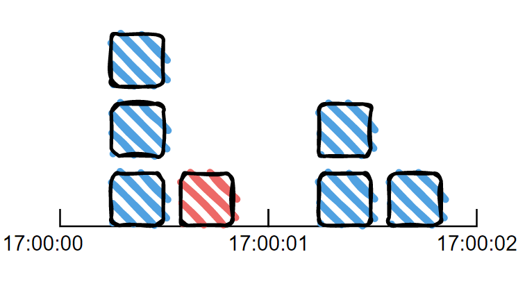
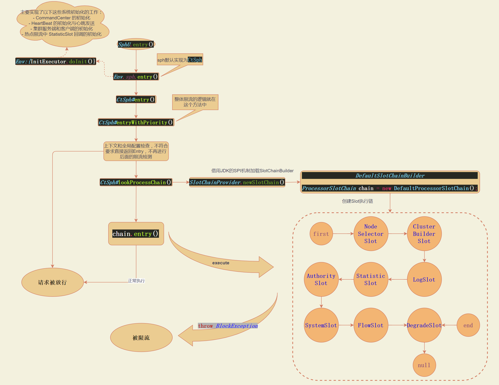

# 阿里限流中间件 Sentinel

说到高可用，大家可能会想到高可用的一些保护手段：缓存、降级、限流等。

今天我们就来聊一聊限流，以及限流常用到的一个开源框架 Sentinel

## 什么是限流？

​	通常来讲，在任意时间到来的请求往往是随机且不可控，而系统的处理能力是有限的。我们需要根据系统的处理能力对流量进行控制，排队处理或者是丢弃等。


## 为什么要限流？

​	如果接口无法控制调用方的行为，在面对热点业务突发请求或者恶意攻击等带来的请求量激增的情况时，就容易导致请求变慢或超时，甚至引起服务器宕机。
​	通过限制并发请求数，使得系统能够正常的处理部分用户的请求，并保证系统的稳定性。

*下面一张图可以解释，这是三峡泄洪的场面*


## 什么是 Sentinel 呢

下面是 Sentinel 的官方简介：

> 随着微服务的流行，服务和服务之间的稳定性变得越来越重要。Sentinel 是面向分布式服务架构的流量控制组件，主要以流量为切入点，从限流、流量整形、熔断降级、系统负载保护、热点防护等多个维度来帮助开发者保障微服务的稳定性。

随着 Alibaba 的生态建设越来越完善，目前 Sentinel 对市面上常见的框架都有了很好的支持，包括 Spring Cloud、Nacos 等等。这也是我们选择 Sentinel 的原因之一（使用简单，对常用框架都有良好的适配）。


### Sentinel 的模块设计

我们来看下 Sentinel 中都有哪些模块：

- sentinel-core 核心模块，限流、降级、系统保护等都在这里实现
- sentinel-dashboard 控制台模块，可以对连接上的sentinel客户端实现可视化的管理
- sentinel-transport 传输模块，提供了基本的监控服务端和客户端的API接口，以及一些基于不同库的实现
- sentinel-extension 扩展模块，主要对DataSource进行了部分扩展实现
- sentinel-adapter 适配器模块，主要实现了对一些常见框架的适配
- sentinel-demo 样例模块，可参考怎么使用sentinel进行限流、降级等
- sentinel-benchmark 基准测试模块，对核心代码的精确性提供基准测试

各个模块基本都是围绕着 sentinel-core 做了一些扩展，而且各个模块之间没有强耦合，是可插拔的，有一张图可以简单的描述这个关系。


### Sentinel 基本概念

* 资源

  资源是 Sentinel 的关键概念。Java 应用程序中它可以是任意内容，比如，由应用程序提供的服务，或由应用程序调用的其它应用提供的服务，甚至可以是一段代码。

  例如：

  ​		可以是一个方法：

  ```java
  @SentinelResource("HelloWorld")
  public void helloWorld() {
      // 资源中的逻辑
      System.out.println("hello world");
  }
  ```

  ​		可以是一段代码：

  ```java
  // 1.5.0 版本开始可以直接利用 try-with-resources 特性，自动 exit entry
  try (Entry entry = SphU.entry("HelloWorld")) {
      // 被保护的逻辑
  	System.out.println("hello world");
   } catch (BlockException ex) {
      // 处理被流控的逻辑
  	System.out.println("blocked!");
   }
  ```
  
    ​		还可以是一个API：

  ```java
  @RestController
  public class TestController {
      @GetMapping("/hello")
      public String test(){
          return "hello world";
      }
  }
  ```
  
* 规则

  围绕资源的实时状态设定的规则，可以包括流量控制规则、熔断降级规则以及系统保护规则。所有规则可以动态实时调整。
  
  例如：
  
  ```java
     private static void initFlowRules(){
          List<FlowRule> rules = new ArrayList<>();
          FlowRule rule = new FlowRule();
          //绑定资源
          rule.setResource("HelloWorld");
          //限流阈值类型
          rule.setGrade(RuleConstant.FLOW_GRADE_QPS);
          //数量级别
          rule.setCount(20);
          //载入规则
          rules.add(rule);
          FlowRuleManager.loadRules(rules);
      }
  ```

### 如何使用

1、Sentinel 对大部分主流框架都做了适配，在 Spring Cloud Alibaba 体系使用的话只需要引入以下 sentinel 的 starter 包，然后项目代码中定义需要限流的资源与限流规则就行。

```xml
<dependency>
    <groupId>com.alibaba.cloud</groupId>
    <artifactId>spring-cloud-starter-alibaba-sentinel</artifactId>
</dependency>
```

引入 spring-cloud-alibaba 依赖包版本管理

```xml
<dependencyManagement>
  <dependencies>
    <dependency>
      <groupId>com.alibaba.cloud</groupId>
      <artifactId>spring-cloud-alibaba-dependencies</artifactId>
      <version>2.1.1.RELEASE</version>
      <type>pom</type>
      <scope>import</scope>
    </dependency>
  </dependencies>
</dependencyManagement>
```

2、如果需要通过控制台来查看监控或管理限流规则，则需要启动 sentinel 提供的 dashboard 项目([GitHub 地址](https://github.com/alibaba/Sentinel.git))，并且在自己项目添加如下配置与 dashboard 通信.
（这里自己的项目和 dashboard 通信就是通过 sentinel-transport 模块实现的）

```yaml
spring:
  cloud:
    sentinel:
      transport:
        port: 8719
        dashboard: localhost:8080
```


### 工作原理

在 Sentinel 里面，所有的资源都对应一个资源名称（`resourceName`），每次资源调用都会创建一个 `Entry` 对象。Entry 可以通过对主流框架的适配自动创建，也可以通过注解的方式或调用 `SphU` API 显式创建。Entry 创建的时候，同时也会创建一系列功能插槽（slot chain），这些插槽有不同的职责，例如:

- `NodeSelectorSlot` 负责收集资源的路径，并将这些资源的调用路径，以树状结构存储起来，用于根据调用路径来限流降级；
- `ClusterBuilderSlot` 则用于存储资源的统计信息以及调用者信息，例如该资源的 RT, QPS, thread count 等等，这些信息将用作为多维度限流，降级的依据；
- `StatisticSlot` 则用于记录、统计不同纬度的 runtime 指标监控信息；
- `FlowSlot` 则用于根据预设的限流规则以及前面 slot 统计的状态，来进行流量控制；
- `AuthoritySlot` 则根据配置的黑白名单和调用来源信息，来做黑白名单控制；
- `DegradeSlot` 则通过统计信息以及预设的规则，来做熔断降级；
- `SystemSlot` 则通过系统的状态，例如 load1 等，来控制总的入口流量；

核心结构如下图所示：


Sentinel 将 `ProcessorSlot` 作为 SPI 接口进行扩展（1.7.2 版本以前 `SlotChainBuilder` 作为 SPI），使得 Slot Chain 具备了扩展的能力。您可以自行加入自定义的 slot 并编排 slot 间的顺序，从而可以给 Sentinel 添加自定义的功能。


其中 StatisticSlot 是 Sentinel 的核心功能插槽之一，用于统计实时的调用数据。
Sentinel 底层采用高性能的**滑动窗口**数据结构 `LeapArray` 来统计实时的秒级指标数据，可以很好地支撑写多于读的高并发场景。
FlowSlot 基于StatisticSlot 统计的数据和规则定义的策略来进行流量控制。

既然这里说到滑动窗口，这里就得引出相较于固定窗口算法的优势了。

* 固定窗口算法

  固定窗口是一种简单的限流算法，它根据限流条件映射一个时间窗口，在这个时间窗口内定义一个计数器，窗口内请求超过上限，则触发限制条件。超过这个窗口时间点后，进入下一个时间窗口，计数器清零，上一个窗口失效。

  比如我的限流条件是每秒只能通过 3 个请求，那如下图所示，17:00:00 开始有请求进入了，到 17:00:01 的时候已经涌进了4笔请求，那么其中有一笔就会触发限流。

  

  这种方式比较好实现，但是缺陷也比较明显，就是无法解决临界问题。如下图：框定的这一秒内承受了 5 笔请求。

  

* 滑动窗口算法

  为了解决固定窗口算法的临界问题，将时间窗口划分成更小的时间窗口，然后随着时间的滑动删除相应的小窗口，而不是直接滑过一个大窗口，这就是滑动窗口算法。

  如下图：我限流条件还是每秒只能通过 3 个请求，但是时间窗口每 0.5秒向前滑动一小格，并丢弃前0.5秒的计数。

  

### 代码视角看运作逻辑

先用一张图来概括代码执行逻辑：



通过一个简单的示例程序，我们了解了sentinel可以对请求进行限流。首先从入口`SphU.entry()` 开始，这个方法会去申请一个entry，如果能够申请成功，则说明没有被限流，否则会抛出BlockException，表示已经被限流了。
（http接口资源限流的入口其实也是 `SphU.entry()` ，断点请求可以看到在接收到http请求时会经过一个 CommonFilter。使用注解@SentinelResource的方式，其原理也是通过框架的动态代理来做到的）

`SphU.entry()` 方法往下执行是 `Env.sph.entry()` ，其中Env类在加载时会进行一些初始化相关的工作`InitExecutor.doInit()`

```java
public class Env {

    public static final Sph sph = new CtSph();

    static {
        // If init fails, the process will exit.
        InitExecutor.doInit();
    }

}
```

Sph的默认实现类是 `CtSph` ，继续往下会执行到 `entryWithPriority(ResourceWrapper resourceWrapper, int count, boolean prioritized, Object... args) throws BlockException` 方法。

**这个方法可以分为以下几个部分：**

* 1、检查上下文和全局配置，不符合直接返回一个 CtEntry ，不再进入下面的限流检测，即表示请求不被限制。

* 2、返回 Slot 链，即：`ProcessorSlotChain `（Sentinel 的核心骨架，将不同的 Slot 按照顺序串在一起，从而将不同的功能（限流、降级、系统保护）组合在一起。）

* 3、执行 SlotChain 的 entry 方法，出现异常则向上抛出，如果上层方法捕获到了`BlockException`，则说明请求被限流了，否则请求能正常执行

其中第2步返回 ProcessorSlotChain 默认是 `DefaultProcessorSlotChain`，代码在 CtSph#entryWithPriority 下的 lookProcessChain(resourceWrapper) 方法调用，里面使用的是 JDK 的 SPI 机制加载的，就意味着我们也可以自定义这些 Slot 链。
这里有一个比较重要的 Slot ， `StatisticSlot` 实时统计指标数据，StatisticSlot 中通过`Constants.ENTRY_NODE` 节点用于统计全局的入口资源数据。基于OccupiableBucketLeapArray 类，实现滑动时间窗，核心代码在其父类 LeapArray#currentWindow() 中。（代码比较长，这里就不贴出来了）

再来研究一下具体流量控制  `FlowSlot` 是怎么做的：
`FlowSlot`  的 entry 方法中可以看到调用了一个 checkFlow 方法，继续进去，最后进入了 `FlowRuleChecker` 的 checkFlow

```java
    public void checkFlow(Function<String, Collection<FlowRule>> ruleProvider, ResourceWrapper resource,
                          Context context, DefaultNode node, int count, boolean prioritized) throws BlockException {
        if (ruleProvider == null || resource == null) {
            return;
        }
        Collection<FlowRule> rules = ruleProvider.apply(resource.getName());
        if (rules != null) {
            for (FlowRule rule : rules) {
                if (!canPassCheck(rule, context, node, count, prioritized)) {
                    throw new FlowException(rule.getLimitApp(), rule);
                }
            }
        }
    }
```

这里通过 ruleProvider.apply(resource.getName())获取到的规则， 其实就是我们通过 FlowRuleManager 配置的限流规则。限流的关键还看 canPassCheck 调用，继续往下会进入到 passLocalCheck ，我们看里面有一个 `rule.getRater()` 的调用，这个方法的目的就是选择使用什么样的策略来限流了。

```
    private static boolean passLocalCheck(FlowRule rule, Context context, DefaultNode node, int acquireCount,
                                          boolean prioritized) {
        Node selectedNode = selectNodeByRequesterAndStrategy(rule, context, node);
        if (selectedNode == null) {
            return true;
        }

        return rule.getRater().canPass(selectedNode, acquireCount, prioritized);
    }
```

sentinel 提供了 4 种限流策略可供选择：默认情况下使用的是 DefaultController

规则配置时也可以指定其他策略，eg：

```java
  private static void initFlowRules(){
    List<FlowRule> rules = new ArrayList<>();
    FlowRule rule = new FlowRule();
    //绑定资源
    rule.setResource("HelloWorld");
    //限流阈值类型
    rule.setGrade(RuleConstant.FLOW_GRADE_QPS);
    //指定限流算法
    rule.setControlBehavior(RuleConstant.CONTROL_BEHAVIOR_WARM_UP);
    //数量级别
    rule.setCount(20);
    //载入规则
    rules.add(rule);
    FlowRuleManager.loadRules(rules);
  }
```

在 FlowRuleUtil 其中有个 generateRater 方法，我们的规则配置就是在这个方法指定的限流策略：

```java
    private static TrafficShapingController generateRater(/*@Valid*/ FlowRule rule) {
        if (rule.getGrade() == RuleConstant.FLOW_GRADE_QPS) {
            switch (rule.getControlBehavior()) {
                case RuleConstant.CONTROL_BEHAVIOR_WARM_UP:
                    return new WarmUpController(rule.getCount(), rule.getWarmUpPeriodSec(),
                        ColdFactorProperty.coldFactor);
                case RuleConstant.CONTROL_BEHAVIOR_RATE_LIMITER:
                    return new RateLimiterController(rule.getMaxQueueingTimeMs(), rule.getCount());
                case RuleConstant.CONTROL_BEHAVIOR_WARM_UP_RATE_LIMITER:
                    return new WarmUpRateLimiterController(rule.getCount(), rule.getWarmUpPeriodSec(),
                        rule.getMaxQueueingTimeMs(), ColdFactorProperty.coldFactor);
                case RuleConstant.CONTROL_BEHAVIOR_DEFAULT:
                default:
                    // Default mode or unknown mode: default traffic shaping controller (fast-reject).
            }
        }
        return new DefaultController(rule.getCount(), rule.getGrade());
    }
```

sentinel 提供了有 4 种策略：

DefaultController
RateLimiterController
WarmUpController
WarmUpRateLimiterController

网上有篇文章对此总结的挺不错的：[Alibaba Sentinel的四种限流策略 - 简书](https://www.jianshu.com/p/5a87b582c35a)

