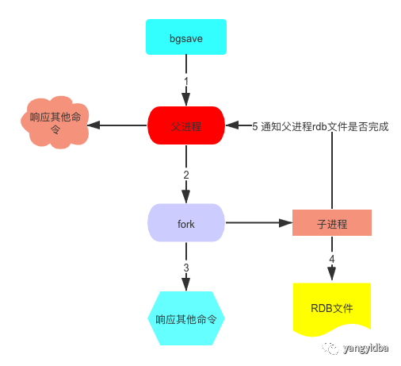
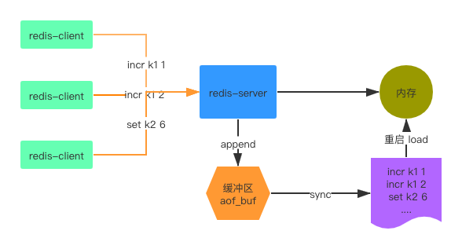
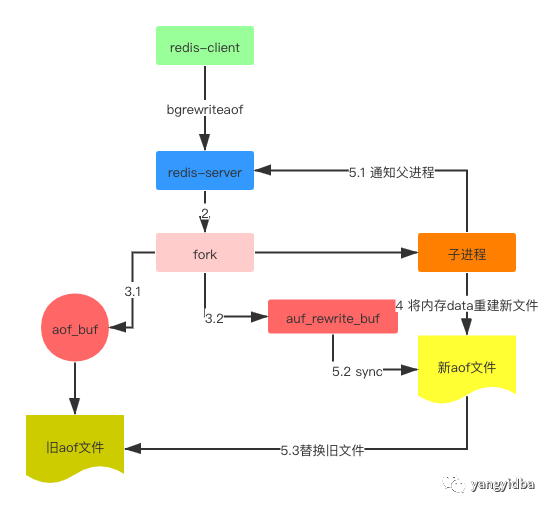

## Redis持久化机制

大家都知道Redis一个内存数据库,它支持2种持久化方式： **RDB(Snapshot 内存快照)**， **AOF(append only file)**。持久化功能将内存中的数据同步到磁盘来避免Redis发生异常导致数据丢失的情况。当Redis实例重启时，即可利用之前持久化的文件实现数据恢复。

接下来，本文介绍两种持久化的运行机制和优缺点。

一 RDB

RDB是默认的持久化方式，按照一定的策略周期性的将内存中的数据生成快照保存到磁盘。

> 每次快照持久化都是将内存数据完整写入到磁盘一次，并不 是增量的只同步脏数据。如果数据量大的话，而且写操作比较多，必然会引起大量的磁盘io操作，可能会严重影响性能。

1.1 快照持久化过程

1.2 触发机制

1. save 命令

> 当客户端向Redis server发送save命令请求进行持久化时，由于Redis是用一个主线程来处理所有,save命令会阻塞Redis server处理其他客户端的请求，直到数据同步完成。

2. bgsave命令

与save命令不同，bgsave是异步执行的，当执行bgsave命令之后，Redis主进程会fork 一个子进程将数据保存到rdb文件中，同步完数据之后，对原有文件进行替换，然后通知主进程表示同步完成。

3. 自动触发

除了手动触发RDB持久化，Redis内部还存在自动触发机制，

> 在配置中集中配置 save m n的方式，表示 m秒内数据集存在n次修改时，系统自动触发bgsave 操作。

1. \# 900s内至少达到一条写命令
2. save 900 1
3. \# 300s内至少达至10条写命令
4. save 300 10
5. \# 60s内至少达到10000条写命令
6. save 60 10000

> 从节点执行全量复制操作，主节点自动执行bgsave 生成RDB文件并发送给从节点
>
> 默认情况下执行 shutdown 命令时，如果没有开启AOF持久化功能，系统会自动执行bgsave命令。执行debug reload 命令重新加载Redis时，也会自动触发save操作。

1.3 相关参数

1. \# 持久化 rdb文件遇到问题时，主进程是否接受写入，yes 表示停止写入，如果是no 表示redis继续提供服务。
2. stop - writes - on - bgsave - error yes
3. 
4. \# 在进行快照镜像时,是否进行压缩。yes:压缩，但是需要一些cpu的消耗。no:不压缩，需要更多的磁盘空间。
5. rdbcompression yes
6. \# 一个CRC64的校验就被放在了文件末尾，当存储或者加载rbd文件的时候会有一个10%左右的性能下降，为了达到性能的最大化，你可以关掉这个配置项。
7. rdbchecksum yes
8. \# 快照的文件名
9. dbfilename dump . rdb
10. \# 存放快照的目录
11. dir / var / lib / redis

1.4 RDB的优缺点

**优点**

RDB文件小，非常适合定时备份，用于灾难恢复。

因为RDB文件中直接存储的是内存数据，而AOF文件中存储的是一条条命令，需要应用命令。Redis加载RDB文件的速度比AOF快很多。

**缺点**

> RDB持久化方式不能做到实时/秒级持久化。实时持久化要全量刷内存到磁盘，成本太高。每秒fork子进程也会阻塞主进程，影响性能。

二 AOF

AOF(Append-only file)针对RDB的缺点做了优化，在使用AOF持久化方式时，Redis会将每一个收到的 **写操作命令**都通过Write函数追加到文件最后，类似于MySQL的binlog。当Redis重启时会通过重新执行文件中保存的 **写命令**来在内存中重建整个数据库的内容。

2.1 AOF持久化过程

1. 客户端发出 bgrewriteaof命令。

2. redis主进程fork子进程。

3. 父进程继续处理client请求，除了把写命令写入到原来的aof文件中。同时把收到的写命令缓存到 **AOF重写缓冲区**。这样就能保证如果子进程重写失败的话并不会出问题。

4. 子进程根据内存快照，按照命令合并规则写入到新AOF文件中。

5. 当子进程把内存快照写入临时文件中后，子进程发信号通知父进程。然后父进程把缓存的写命令也写入到临时文件。

6. 现在父进程可以使用临时文件替换老的aof文件，并重命名，后面收到的写命令也开始往新的aof文件中追加。

2.2 相关参数

1. \# 是否开启AOF，默认关闭
2. appendonly yes
3. \# 指定 AOF 文件名
4. appendfilename appendonly . aof
5. \# Redis支持三种刷写模式：
6. \# appendfsync always #每次收到写命令就立即强制写入磁盘，类似MySQL的sync_binlog=1,是最安全的。但该模式下速度也是最慢的，一般不推荐使用。
7. appendfsync everysec #每秒钟强制写入磁盘一次，在性能和持久化方面做平衡，推荐该方式。
8. \# appendfsync no #完全依赖OS的写入，一般为30秒左右一次，性能最好但是持久化最没有保证，不推荐。
9. 
10. \#在日志重写时，不进行命令追加操作，而只是将其放在缓冲区里，避免与命令的追加造成DISK IO上的冲突。
11. \#设置为yes表示rewrite期间对新写操作不fsync,暂时存在内存中,等rewrite完成后再写入，默认为no，建议yes
12. no - appendfsync - on - rewrite yes
13. \#当前AOF文件大小是上次日志重写得到AOF文件大小的二倍时，自动启动新的日志重写过程。
14. auto - aof - rewrite - percentage 100
15. \#当前AOF文件启动新的日志重写过程的最小值，避免刚刚启动Reids时由于文件尺寸较小导致频繁的重写。
16. auto - aof - rewrite - min - size 64mb

2.3 日志重写

AOF机制将客户端的每一个写操作都追加到aof文件末尾，比如将一个key多次执行incr,set命令,会写入多次命令到aof文件，aof文件会越来越大，部分核心业务每天的写入量有几十G的大小。

1. incr k1 1
2. set k2 a
3. set k2 b
4. incr k1 2
5. incr k1 3
6. set k2 c
7. del k3
8. ...
9. incr k1 100

恢复Redis实例时，加载非常大的aof文件耗时会很长。为了解决这个问题，Redis 支持aof文件重写--把Redis进程内的数据转化为写命令同步到新AOF文件中的过程。通过重写，可以生成一个最小的命令集合。比如上面的几个命令可以合并为

1. incr k1 100
2. set k2 c

**写入数据的规则**

1. 进程内过期的数据不用在写入

2. 旧AOF文件含有的无效命令 del k1, set a 1, set a 2。重写使用进程内的数据直接生成，aof文件就保留最新的命令集合。

3. 多条命令可以合并为一个命令，为了防止单个命令过大造成客户端缓冲区溢出，对于list,set,hash,zset 等类型的操作，以64个元素为界拆分为多条。

**触发机制**

1. 手动触发 执行bgrewriteaof命令。

2. 根据配置自动触发

auto-aof-rewrite-min-size 表示运行AOF重写是文件最小的大小。默认64M，小于64M就会不自动重写了。

auto-aof-rewrite-percentage 表示（ aof_current_size - aof_base_size ） / aof_base_size 的比值。

**aof文件重写之后当前文件大小增长多少就触发重写**

自动触发时机 :

aof_current_size > auto-aof-rewrite-min-size

&&

( aof_current_size - aof_base_size ) / aof_base_size >= auto-aof-rewrite-percentage

三 RDB VS AOF 对比

具体使用哪种持久化方式 ，下面是来自官方的建议：

> 通常，如果你要想提供很高的数据保障性，那么建议你同时使用两种持久化方式。如果你可以接受灾难带来的几分钟的数据丢失，那么你可以仅使用RDB。很多用户仅使用了AOF，但是我们建议，既然RDB可以时不时的给数据做个完整的快照，并且提供更快的重启，所以最好还是也使用RDB。

生产上的实例大多不会是单点，而是主从，也有利用slave作为持久化方式，同时满足HA的需求。读者朋友可以分享一下各自遇到的和 redis 持久化相关的问题。